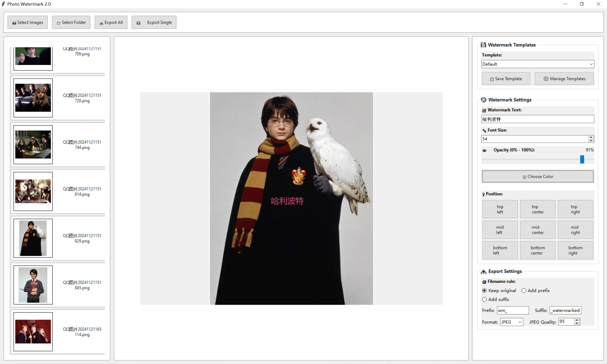

# Photo Watermark 2.0

一个基于 Tkinter 的图片批量加水印工具，支持拖拽导入、九宫格定位/相对定位/手动拖拽定位、模板管理以及批量导出。

## 截图（Screenshots）
下面展示两个界面状态：

- 初始界面（Initial UI）：

  

- 工作中界面（Working UI）：

  

## 功能特性
- 拖拽或文件/文件夹选择导入图片，侧栏缩略图列表管理
- 水印文本、字体大小（支持自动随图片尺寸估算）、透明度、颜色设置
- 位置支持：九宫格（上中下/左中右）、相对定位（0 - 1 范围）、手动拖拽
- 模板管理：保存、编辑、删除自定义模板，默认模板受保护且支持自动字号
- 导出：批量/单张导出，支持 JPEG/PNG，设置 JPEG 质量、文件名前后缀规则
- 现代化 UI 风格（ttk 样式），更好的交互体验

## 快速开始
### 环境准备
- 安装 Python 3.x
- 安装依赖：
  ```bash
  pip install -r requirements.txt
  ```
  依赖列表：Pillow、tkinterdnd2（用于拖放支持）

### 运行
```bash
python src/main.py
```
运行后将启动“Photo Watermark 2.0”主界面（Windows 下默认最大化）。

## 使用说明
1. 导入图片：
   - 顶部工具栏点击“Select Images/Select Folder”导入，或直接拖拽图片到工作区
   - 左侧显示缩略图列表，点击缩略图即可在中间工作区预览
2. 设置水印：
   - 文本：在“Watermark Settings”中输入水印文字
   - 字号：手动设置或启用“Auto font size”（模板中可选），自动随图片尺寸估算
   - 透明度：0% - 100%（内部会转为 0 - 255），右侧动态显示当前值
   - 颜色：点击“Choose Color”选择颜色
   - 位置：
     - 九宫格预设：top/mid/bottom + left/center/right
     - 相对定位：在模板对话框中选择“relative”，设置 X/Y（0 - 1）相对位置
     - 手动拖拽：在工作区按住左键拖动水印，程序会切换到“manual”模式并记录实际坐标
3. 模板管理：
   - “Save Template”：保存当前设置为新模板（默认模板不可修改）
   - “Manage Templates”：编辑/删除已有模板，支持重命名（默认模板不可删除/修改）
   - 模板切换会立即应用到当前设置，并持久化选择项
4. 导出：
   - 批量导出：点击“Export All”，按命名规则与格式/质量保存所有已导入图片
   - 单张导出：点击“Export Single”仅导出当前预览图片
   - 命名规则：保持原名/添加前缀/添加后缀，可配置前缀（默认 wm_）与后缀（默认 _watermarked）
   - 格式：JPEG/PNG；JPEG 可设置质量（1 - 100）

## 配置与模板
应用使用项目根目录下的 `config.json` 持久化模板与当前选择。默认模板示例如下：
```json
{
  "templates": {
    "Default": {
      "text": "Your Watermark",
      "font_size": 40,
      "font_size_auto": true,
      "opacity": 50,
      "color": [255, 255, 255],
      "position_mode": "relative",
      "offset_x": 0.5,
      "offset_y": 0.5
    }
  },
  "selected_template": "Default"
}
```
说明：
- opacity 为 0 - 100 的百分比；程序内部会自动转换到绘制所需的 0 - 255 范围
- color 为 RGB 列表；绘制时会结合透明度生成最终 RGBA
- position_mode 支持：
  - 九宫格：top-left/top-center/top-right/mid-left/mid-center/mid-right/bottom-left/bottom-center/bottom-right
  - relative：相对定位（0 - 1），在可绘制范围内计算实际坐标
  - manual：手动模式，直接使用 offset_x/offset_y 作为像素坐标

## 目录结构
```
Photo-Watermark-2-2/
├── config.json
├── requirements.txt
├── src/
│   ├── main.py                  # 应用入口，创建 TkinterDnD 根窗口并启动主界面
│   ├── ui/
│   │   └── main_window.py       # 主界面与交互逻辑：导入、预览、设置、模板、导出等
│   └── core/
│       ├── image_processor.py   # 加载/缩略图/绘制水印/保存；位置计算与字体加载
│       ├── config_manager.py    # 模板与选择项的集中管理/持久化
│       └── watermark.py         # 水印对象定义（文本/字号/颜色/位置）
```

## 字体与中文支持
- 程序在 Windows 下优先尝试常见 CJK 字体（如 Microsoft YaHei、SimHei、SimSun 等），若不可用会回退到 Arial，再回退到 PIL 默认字体
- 如果遇到中文显示为方块或缺字，请在系统安装 CJK 字体，或在代码中为 Watermark 指定 `font_path`

## 常见问题
- 拖拽不起作用：请确保已安装 tkinterdnd2 并在支持 Tk 的环境运行；跨平台行为受 Tk 版本影响
- 导出 JPEG 透明背景：JPEG 不支持透明，程序会自动以白色背景合成；如需透明请导出 PNG
- 默认模板不可修改/删除：这是设计行为，用于保证应用始终有一个可用模板

## 发布与下载
- GitHub Releases 提供两种下载方式：
  - 一体化（onefile）EXE：下载后直接双击运行，无需解压或安装（文件名示例：PhotoWatermark2-onefile-win-x64.exe）。
  - 免安装文件夹版（zip）：解压后进入文件夹，双击 PhotoWatermark2.exe 运行（文件名示例：PhotoWatermark2-win-x64.zip）。

- 运行提示：
  - 首次启动 onefile EXE 可能略慢，因为会将内置资源解压到临时目录；后续启动会更快。
  - Windows SmartScreen 可能提示“已阻止不常见应用”，请点击“更多信息”→“仍要运行”。
  - 配置文件 config.json 默认写入程序所在目录。请将 EXE 或解压后的文件夹放在具有写入权限的位置（如用户目录），以正常保存模板与设置。

- 发布与自动化：
  - 当仓库推送版本标签（例如 v2.0.1、v2.1.0）时，GitHub Actions 会自动创建 Release 并上传上述资产。
  - 工作流文件位置：.github/workflows/release.yml。

## 许可证
未设置许可证。如需开放源代码协议，请在项目根目录添加 LICENSE 并在此处补充说明。